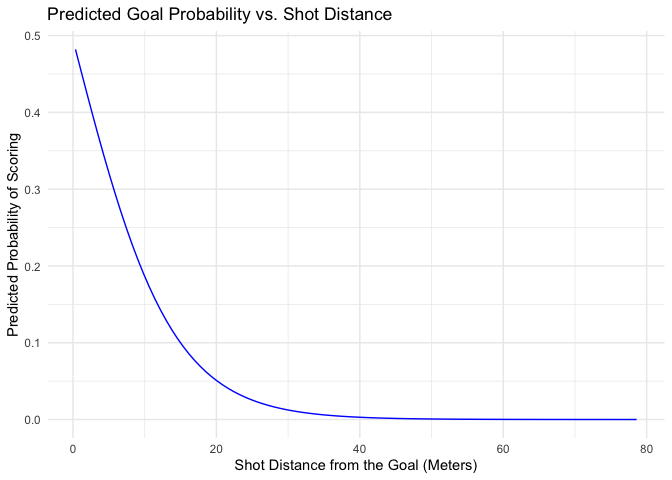
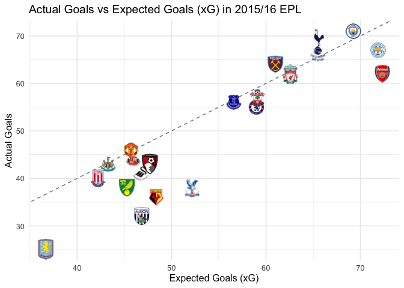
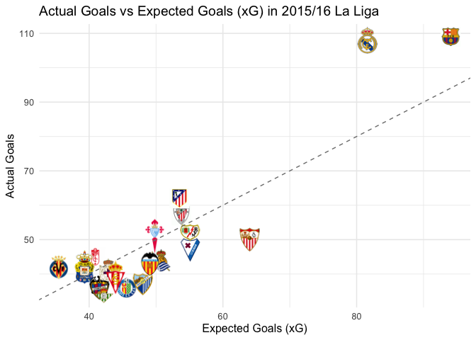

# Geospatial Data Science: Building an Expected Goals (xG) Model

**Authors:** Tirdod Behbehani, Oliver Tausendschön, Adrian Alejandro Vacca Bonilla  
**University:** Barcelona School of Economics  
**Course:** Geospatial Data Science and Economic Spatial Models  
**Date:** March 24, 2025

# Introduction

As football tracking data improves, the ability to derive meaningful
insights becomes much more accessible to the general public. In this
project, we set out to explore how football shots have evolved over
time, and whether we could build our own expected goals (xG) model. xG models
estimate the probability of a given shot resulting in a goal.

To do this, we use open-access data provided by StatsBomb. For each
event in a match (like a shot, pass, dribble, save, or duel), StatsBomb
provides detailed event-level information on what occurred on the pitch.
We have this data across 13 competitions for a wide timeframe, from 1958
to 2024.

Ultimately, our objective is to see if just using a few simple features (ex. 
shot distance, shot angle to the goal, whether the shot was taken
under pressure) can adequately predict the chance of a given shot
resulting in a goal.

For this project, we will rely on the package StatsBombR. This package
gives us access to detailed, event-level football data — including
passes, shots, dribbles, and more — from professional matches around the
world. Our raw StatsBomb data rendered us with 70,553 shot observations and 121 features.

# Results

We can use our xG model to observe the relationship between distance to the goal and predicted
goal probability.

Our model clearly illustrates that predicted goal probability
decreases exponentially as the shot distance increases.

We can try using the expected goal predictions to compare that to actual
goals scored. We’ll use the 2015/16 English Premier League as our first
example. We will evaluate actual vs expected goal performance for both
teams and players. 

<h3>Top 10 Overperforming Teams (2015/16 EPL)</h3>

<table>
  <thead>
    <tr>
      <th>Team</th>
      <th>Actual Goals</th>
      <th>Expected Goals</th>
      <th>Goal Diff</th>
    </tr>
  </thead>
  <tbody>
    <tr><td>West Ham United</td><td>64.0</td><td>61.0</td><td>+3.0</td></tr>
    <tr><td>Tottenham Hotspur</td><td>68.0</td><td>65.5</td><td>+2.5</td></tr>
    <tr><td>Manchester City</td><td>71.0</td><td>69.3</td><td>+1.8</td></tr>
    <tr><td>Manchester United</td><td>46.0</td><td>45.7</td><td>+0.3</td></tr>
    <tr><td>Newcastle United</td><td>43.0</td><td>43.3</td><td>-0.3</td></tr>
    <tr><td>Liverpool</td><td>62.0</td><td>62.6</td><td>-0.6</td></tr>
    <tr><td>Everton</td><td>56.0</td><td>56.6</td><td>-0.6</td></tr>
    <tr><td>Sunderland</td><td>44.0</td><td>45.9</td><td>-1.9</td></tr>
    <tr><td>Southampton</td><td>57.0</td><td>59.1</td><td>-2.1</td></tr>
    <tr><td>Stoke City</td><td>40.0</td><td>42.2</td><td>-2.2</td></tr>
  </tbody>
</table>

<h3>Top 10 Underperforming Teams (2015/16 EPL)</h3>

<table>
  <thead>
    <tr>
      <th>Team</th>
      <th>Actual Goals</th>
      <th>Expected Goals</th>
      <th>Goal Diff</th>
    </tr>
  </thead>
  <tbody>
    <tr><td>West Bromwich Albion</td><td>32.0</td><td>46.8</td><td>-14.8</td></tr>
    <tr><td>Crystal Palace</td><td>38.0</td><td>52.2</td><td>-14.2</td></tr>
    <tr><td>Watford</td><td>36.0</td><td>48.4</td><td>-12.4</td></tr>
    <tr><td>Aston Villa</td><td>25.0</td><td>36.7</td><td>-11.7</td></tr>
    <tr><td>Arsenal</td><td>62.0</td><td>72.3</td><td>-10.3</td></tr>
    <tr><td>Norwich City</td><td>38.0</td><td>45.3</td><td>-7.3</td></tr>
    <tr><td>Swansea City</td><td>41.0</td><td>46.7</td><td>-5.7</td></tr>
    <tr><td>Leicester City</td><td>67.0</td><td>71.9</td><td>-4.9</td></tr>
    <tr><td>AFC Bournemouth</td><td>43.0</td><td>47.7</td><td>-4.7</td></tr>
    <tr><td>Chelsea</td><td>55.0</td><td>59.0</td><td>-4.0</td></tr>
  </tbody>
</table>

We use a linear trend line to represent the relationship between 
actual and expected goals. If a team's actual goal
output is above the trend line, then the team/player has scored more
goals than expected. If a team’s output is below the trend line,
then the team/player has scored less goals than expected.

We can see that only 3 of the 20 Premier League teams overperformed
their expected goal output in 2015/16. Arsenal, who finished in 2nd place,
underperformed their expected goal output by a whopping 14 goals.
If Arsenal had been more clinical in front of goal, it likely
would have had a real shot at the title. Following the 2015/16 season,
Arsenal made it a point of emphasis to sign a new striker. Arsenal
targeted Leicester City striker Jamie Vardy, but ultimately settled for
signed Lucas Perez from Deportivo La Coruña for €20M
following Vardy’s rejection.

Now, let's analyze the players with the greatest discrepancies between
actual and expected goals.

<h3>Top 10 Overperforming Players (2015/16 EPL)</h3>

<table>
  <thead>
    <tr>
      <th>Player</th>
      <th>Team</th>
      <th>Actual Goals</th>
      <th>Expected Goals</th>
      <th>Goal Diff</th>
    </tr>
  </thead>
  <tbody>
    <tr><td>Sergio Leonel Agüero del Castillo</td><td>Manchester City</td><td>24.0</td><td>17.6</td><td>+6.4</td></tr>
    <tr><td>Riyad Mahrez</td><td>Leicester City</td><td>17.0</td><td>12.7</td><td>+4.3</td></tr>
    <tr><td>Dimitri Payet</td><td>West Ham United</td><td>9.0</td><td>4.8</td><td>+4.2</td></tr>
    <tr><td>Anthony Martial</td><td>Manchester United</td><td>11.0</td><td>7.1</td><td>+3.9</td></tr>
    <tr><td>Georginio Wijnaldum</td><td>Newcastle United</td><td>11.0</td><td>7.2</td><td>+3.8</td></tr>
    <tr><td>Jamie Vardy</td><td>Leicester City</td><td>24.0</td><td>20.2</td><td>+3.8</td></tr>
    <tr><td>Kelechi Promise Iheanacho</td><td>Manchester City</td><td>8.0</td><td>4.3</td><td>+3.7</td></tr>
    <tr><td>Harry Kane</td><td>Tottenham Hotspur</td><td>25.0</td><td>21.4</td><td>+3.6</td></tr>
    <tr><td>Aaron Lennon</td><td>Everton</td><td>5.0</td><td>1.8</td><td>+3.2</td></tr>
    <tr><td>Roberto Firmino Barbosa de Oliveira</td><td>Liverpool</td><td>10.0</td><td>6.9</td><td>+3.1</td></tr>
  </tbody>
</table>

<h3>Top 10 Underperforming Players (2015/16 EPL)</h3>

<table>
  <thead>
    <tr>
      <th>Player</th>
      <th>Team</th>
      <th>Actual Goals</th>
      <th>Expected Goals</th>
      <th>Goal Diff</th>
    </tr>
  </thead>
  <tbody>
    <tr><td>Cameron Jerome</td><td>Norwich City</td><td>3.0</td><td>8.2</td><td>-5.2</td></tr>
    <tr><td>Shinji Okazaki</td><td>Leicester City</td><td>5.0</td><td>9.4</td><td>-4.4</td></tr>
    <tr><td>Wilfried Guemiand Bony</td><td>Manchester City</td><td>4.0</td><td>7.9</td><td>-3.9</td></tr>
    <tr><td>Jesús Navas González</td><td>Manchester City</td><td>0.0</td><td>3.1</td><td>-3.1</td></tr>
    <tr><td>Chris Smalling</td><td>Manchester United</td><td>0.0</td><td>3.0</td><td>-3.0</td></tr>
    <tr><td>Etienne Capoue</td><td>Watford</td><td>0.0</td><td>2.8</td><td>-2.8</td></tr>
    <tr><td>Oscar dos Santos Emboaba Júnior</td><td>Chelsea</td><td>3.0</td><td>5.7</td><td>-2.7</td></tr>
    <tr><td>Moussa Sissoko</td><td>Newcastle United</td><td>1.0</td><td>3.7</td><td>-2.7</td></tr>
    <tr><td>Christian Benteke Liolo</td><td>Liverpool</td><td>9.0</td><td>11.6</td><td>-2.6</td></tr>
    <tr><td>Aleksandar Mitrović</td><td>Newcastle United</td><td>9.0</td><td>11.6</td><td>-2.6</td></tr>
  </tbody>
</table>

Interestingly enough, two of the three players who had the greatest
overperformance in front of goal were Leicester City’s Riyad Mahrez and
Jamie Vardy. Mahrez scored 17 goals from 10.4 expected goals, while
Vardy scored 24 goals from 18.6 expected goals. 

This overperformance in front of goal powered Leicester City to win the Premier League title
despite being 5000-1 underdogs at the start of the season. As our
results would indicate, this overperformance was not sustainable, which led
to Leicester City almost being relegated in the following season

Now that we have studied the English Premier League in 2015/16, let’s
analyze the Spanish La Liga in that same 2015/16 season.

<h3>Top 10 Overperforming Teams (2015/16 La Liga)</h3>

<table>
  <thead>
    <tr>
      <th>Team</th>
      <th>Actual Goals</th>
      <th>Expected Goals</th>
      <th>Goal Diff</th>
    </tr>
  </thead>
  <tbody>
    <tr><td>Real Madrid</td><td>108.0</td><td>81.6</td><td>26.4</td></tr>
    <tr><td>Barcelona</td><td>109.0</td><td>94.1</td><td>14.9</td></tr>
    <tr><td>Atlético Madrid</td><td>62.0</td><td>53.5</td><td>8.5</td></tr>
    <tr><td>Villarreal</td><td>42.0</td><td>35.5</td><td>6.5</td></tr>
    <tr><td>Granada</td><td>45.0</td><td>40.9</td><td>4.1</td></tr>
    <tr><td>Athletic Club</td><td>57.0</td><td>53.8</td><td>3.2</td></tr>
    <tr><td>Las Palmas</td><td>42.0</td><td>39.3</td><td>2.7</td></tr>
    <tr><td>Celta Vigo</td><td>51.0</td><td>49.8</td><td>1.2</td></tr>
    <tr><td>RC Deportivo La Coruña</td><td>41.0</td><td>43.0</td><td>-2.0</td></tr>
    <tr><td>Rayo Vallecano</td><td>52.0</td><td>55.1</td><td>-3.1</td></tr>
  </tbody>
</table>

<h3>Top 10 Underperforming Teams (2015/16 La Liga)</h3>

<table>
  <thead>
    <tr>
      <th>Team</th>
      <th>Actual Goals</th>
      <th>Expected Goals</th>
      <th>Goal Diff</th>
    </tr>
  </thead>
  <tbody>
    <tr><td>Sevilla</td><td>50.0</td><td>64.0</td><td>-14.0</td></tr>
    <tr><td>Málaga</td><td>37.0</td><td>48.0</td><td>-11.0</td></tr>
    <tr><td>Espanyol</td><td>38.0</td><td>47.9</td><td>-9.9</td></tr>
    <tr><td>Getafe</td><td>36.0</td><td>45.6</td><td>-9.6</td></tr>
    <tr><td>Real Betis</td><td>34.0</td><td>42.2</td><td>-8.2</td></tr>
    <tr><td>Eibar</td><td>48.0</td><td>55.1</td><td>-7.1</td></tr>
    <tr><td>Real Sociedad</td><td>44.0</td><td>50.7</td><td>-6.7</td></tr>
    <tr><td>Valencia</td><td>43.0</td><td>49.1</td><td>-6.1</td></tr>
    <tr><td>Levante UD</td><td>36.0</td><td>41.5</td><td>-5.5</td></tr>
    <tr><td>Sporting Gijón</td><td>39.0</td><td>43.9</td><td>-4.9</td></tr>
  </tbody>
</table>

Barcelona and Real Madrid's offensive output was miles ahead of the rest of the league in
2015/16! They each scored the most actual goals, while having the two
highest actual vs. expected goal differentials.

Now, let's analyze the players with the greatest discrepancies between
actual and expected goals.

<h3>Top 10 Overperforming Players (2015/16 La Liga)</h3>

<table>
  <thead>
    <tr>
      <th>Player</th>
      <th>Team</th>
      <th>Actual Goals</th>
      <th>Expected Goals</th>
      <th>Goal Diff</th>
    </tr>
  </thead>
  <tbody>
    <tr><td>Luis Alberto Suárez Díaz</td><td>Barcelona</td><td>40.0</td><td>26.6</td><td>13.4</td></tr>
    <tr><td>Gareth Frank Bale</td><td>Real Madrid</td><td>19.0</td><td>8.5</td><td>10.6</td></tr>
    <tr><td>Antoine Griezmann</td><td>Atlético Madrid</td><td>22.0</td><td>13.6</td><td>8.4</td></tr>
    <tr><td>Cristiano Ronaldo dos Santos Aveiro</td><td>Real Madrid</td><td>35.0</td><td>28.7</td><td>6.3</td></tr>
    <tr><td>Karim Benzema</td><td>Real Madrid</td><td>24.0</td><td>18.3</td><td>5.7</td></tr>
    <tr><td>Imanol Agirretxe Arruti</td><td>Real Sociedad</td><td>13.0</td><td>8.7</td><td>4.3</td></tr>
    <tr><td>Jozabed Sánchez Ruiz</td><td>Rayo Vallecano</td><td>9.0</td><td>4.8</td><td>4.2</td></tr>
    <tr><td>Lucas Pérez Martínez</td><td>RC Deportivo La Coruña</td><td>17.0</td><td>12.8</td><td>4.2</td></tr>
    <tr><td>Cédric Bakambu</td><td>Villarreal</td><td>12.0</td><td>7.9</td><td>4.1</td></tr>
    <tr><td>Iñaki Williams Arthuer</td><td>Athletic Club</td><td>8.0</td><td>4.0</td><td>4.0</td></tr>
  </tbody>
</table>

<h3>Top 10 Underperforming Players (2015/16 La Liga)</h3>

<table>
  <thead>
    <tr>
      <th>Player</th>
      <th>Team</th>
      <th>Actual Goals</th>
      <th>Expected Goals</th>
      <th>Goal Diff</th>
    </tr>
  </thead>
  <tbody>
    <tr><td>Álvaro Vázquez García</td><td>Getafe</td><td>5.0</td><td>9.4</td><td>-4.4</td></tr>
    <tr><td>Carlos Alberto Vela Garrido</td><td>Real Sociedad</td><td>5.0</td><td>8.2</td><td>-3.2</td></tr>
    <tr><td>Diego Roberto Godín Leal</td><td>Atlético Madrid</td><td>1.0</td><td>3.9</td><td>-2.9</td></tr>
    <tr><td>Pablo Pérez Rodríguez</td><td>Sporting Gijón</td><td>0.0</td><td>2.8</td><td>-2.8</td></tr>
    <tr><td>Rodrigo Moreno Machado</td><td>Valencia</td><td>2.0</td><td>4.8</td><td>-2.8</td></tr>
    <tr><td>Nordin Amrabat</td><td>Málaga</td><td>0.0</td><td>2.7</td><td>-2.7</td></tr>
    <tr><td>David Barral Torres</td><td>Granada</td><td>0.0</td><td>2.6</td><td>-2.6</td></tr>
    <tr><td>Roger Martí Salvador</td><td>Levante UD</td><td>0.0</td><td>2.5</td><td>-2.5</td></tr>
    <tr><td>Grzegorz Krychowiak</td><td>Sevilla</td><td>0.0</td><td>2.5</td><td>-2.5</td></tr>
    <tr><td>Jorge Andújar Moreno</td><td>Sevilla</td><td>1.0</td><td>3.5</td><td>-2.5</td></tr>
  </tbody>
</table>

We can see that 4 of the 10 players who most
outperformed their expected goal tallies played for Real Madrid or
Barcelona.

# Conclusion and Future Research

Our expected goals model does a pretty good job of estimating the probability of a goal 
given some pre-shot context. Information such as shot distance, shot angle, and whether 
the shot was taken under pressure help inform the likelihood of a given shot being a goal.
For instance, goal probability decreases exponentially the further back a player elects to
shoot from.

Standard xG models, however, treat all players equally regardless of individual skill.
It does not consider the quality of the player taking the shot into account.
This is a known limitation of standard xG models.

We often see elite players 
overperform their expected goal outputs over time
because they are clinical players who can convert difficult chances at a
higher rate than the average player. Meanwhile, we might see isolated seasons
where a player comes out of nowhere and takes the league by storm. With
limited data, it can become difficult to know whether the player's goalscoring
exploits in just one season will be predictive, or if the player's goalscoring
will regress to the mean.

This conundrum limits the predictive power of simple expected goals models, as
they are designed to analyze historical performance and not meant to be
predictive. [However, there are experimental approaches that use
Bayesian methodologies to explore the influence of a particular player
or position on predicting goal
probabilities.](https://www.frontiersin.org/journals/sports-and-active-living/articles/10.3389/fspor.2024.1348983/full)

