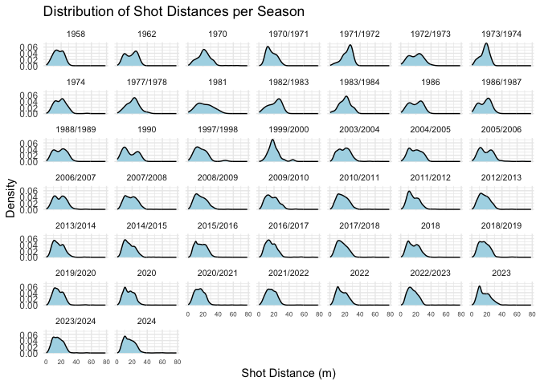
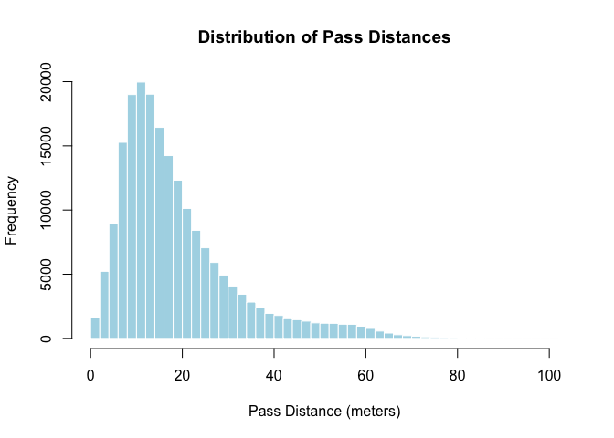
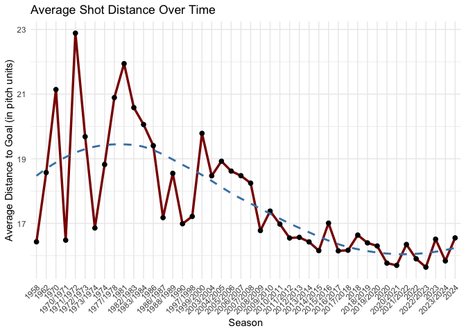
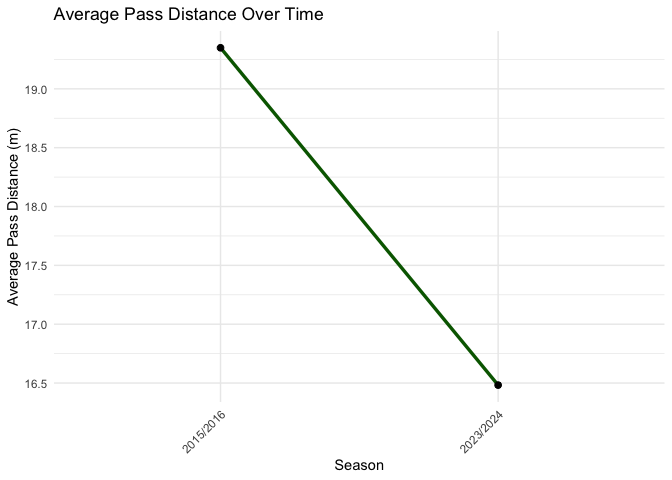
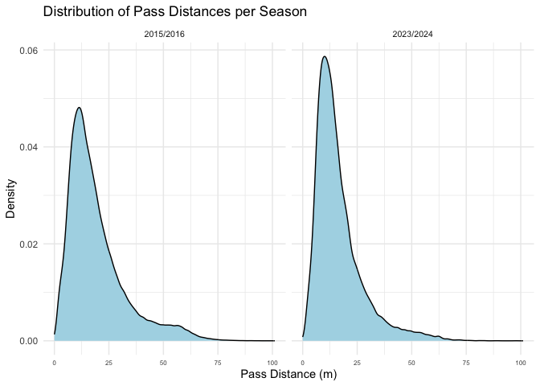
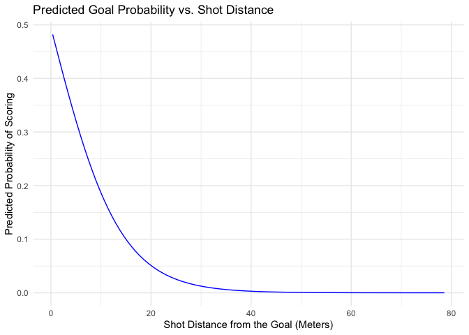
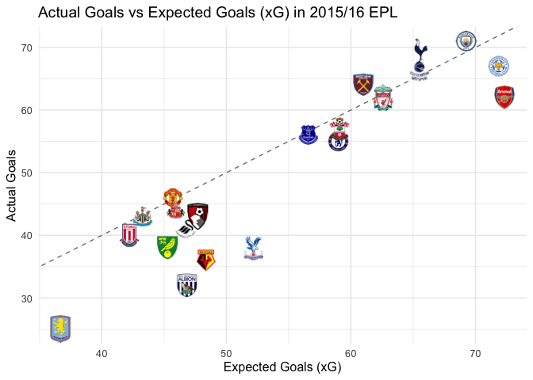
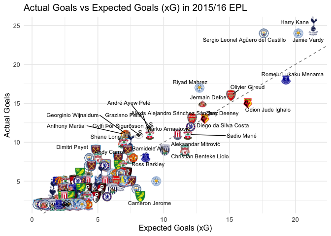
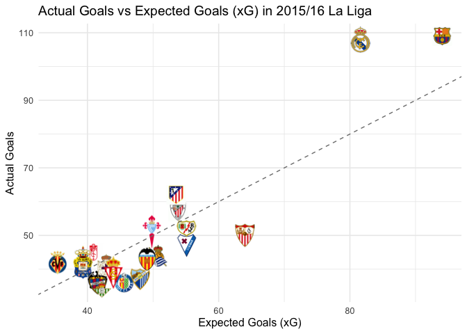
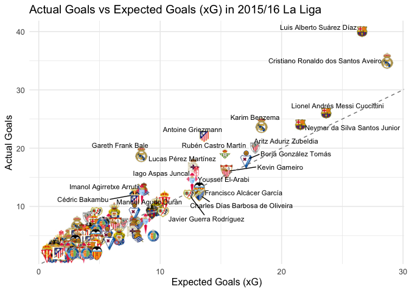

# Geospatial Final Exam

**Authors**: Tirdod Behbehani, Oliver Tausendschön, Adrian Alejandro
Vacca Bonilla

**Date**: 2025-03-24

# Introduction

As football enthusiasts, we are keen on analyzing games in great depth.
Fortunately, the growing availability of open football data provides
many opportunities to do so. This was one of the main motivations for
our project. We set out to explore how shots have evolved over time, and
whether we could build our own expected goals (xG) model — a tool widely
used in football analytics to estimate the probability of a shot
resulting in a goal.

To do this, we use open-access data provided by StatsBomb. For each
event in a match (like a shot, pass, dribble, save, or duel), StatsBomb
provides detailed event-level information on what occurred on the pitch.
We have this data across 13 competitions for a wide timeframe, from 1958
to 2024.

Ultimately, our goal is to test the hypothesis that closer shots have a
higher chance of resulting in goals, and to see whether this insight is
reflected in trends over time. In other words: are teams becoming more
conservative, favoring high-probability chances over long-range efforts?
In the end, we might see this being reflected in our xG model. The code
for this project can also be found on
[GitHub](https://github.com/otausendschoen/Football_Analysis).

# Section I: Set Up Data & Libraries

For this project, we will rely on the package StatsBombR. This package
gives us access to detailed, event-level football data — including
passes, shots, dribbles, and more — from professional matches around the
world.

In general, the package is used in the following way:

-   Load a set of competitions and matches
-   Download all event data for those matches
-   Do analysis on subsets of this data. For example, we will start
    analyzing how shots behave over time below.

In general, we can use the following code to obtain the data via the
package’s API. We use the API to load the data to power the heatmaps and
shot charts we see in Section II, which only use FIFA World Cup data.
However, the dataset that we use to train our model is very big and
covers more competitions, so we decided to attach it as a CSV.
Nevertheless, the code we used to obtain the model training data is
commented out below:

    # #Pulling StatsBomb Free Data Into R
    # library(tidyverse)
    # library(StatsBombR)
    # Comps <- FreeCompetitions()
    # comps_shots <- Comps %>%
    #   filter(
    #     competition_gender == 'male',
    #     !competition_name %in% c('FIFA U20 World Cup', 'Indian Super league', 'Major League Soccer', 'North American League')
    #   )
    # 
    # Matches <- FreeMatches(Comps)
    # 
    # Matches_Shots <- Matches
    # 
    # Matches_Passes <- Matches %>%
    #   filter(year(match_date) >= 2000)
    # 
    # StatsBombData_Shots <- free_allevents(MatchesDF = Matches_Shots, Parallel = T)
    # StatsBombData_Passes <- free_allevents(MatchesDF = Matches_Passes, Parallel = T)
    # 
    # StatsBombData_Shots = allclean(StatsBombData_Shots)
    # StatsBombData_Passes = allclean(StatsBombData_Passes)
    # 
    # shots <- StatsBombData_Shots %>%
    #   filter(type.name == "Shot", !is.na(location)) %>%
    #   unnest_wider(location, names_sep = "_") %>%
    #   rename(x = location_1, y = location_2)
    # 
    # passes <- StatsBombData_Passes %>%
    #   filter(type.name == "Pass", !is.na(location)) %>%
    #   unnest_wider(location, names_sep = "_") %>%
    #   rename(x = location_1, y = location_2)
    # 
    # shots <- shots %>%
    #   left_join(
    #     Matches %>%
    #       select(match_id, match_date),
    #     by = "match_id"
    #   ) %>%
    #   left_join(
    #     Comps %>%
    #       select(competition_id, season_id, competition_name, season_name),
    #     by = c("competition_id", "season_id")
    #   ) %>%
    #   mutate(match_date = as.Date(match_date))
    # 
    # shots_clean <- shots %>%
    #   select(
    #     -carry.end_location,
    #     -goalkeeper.end_location,
    #     -tactics.lineup,
    #     -related_events,
    #     -shot.freeze_frame,
    #     -pass.end_location
    #   ) %>%
    #   unnest_wider(shot.end_location, names_sep = "_") %>%
    #   rename(
    #     shot.end_x = shot.end_location_1,
    #     shot.end_y = shot.end_location_2
    #   )
    # 
    # passes <- passes %>%
    #   left_join(
    #     Matches %>%
    #       select(match_id, match_date),
    #     by = "match_id"
    #   ) %>%
    #   left_join(
    #     Comps %>%
    #       select(competition_id, season_id, competition_name, season_name),
    #     by = c("competition_id", "season_id")
    #   ) %>%
    #   mutate(match_date = as.Date(match_date))
    # 
    # passes_clean <- passes %>%
    #   select(
    #     -carry.end_location,
    #     -goalkeeper.end_location,
    #     -tactics.lineup,
    #     -related_events,
    #     -shot.end_location,
    #     -shot.freeze_frame
    #   ) %>%
    #   unnest_wider(pass.end_location, names_sep = "_") %>%
    #   rename(
    #     pass.end_x = pass.end_location_1,
    #     pass.end_y = pass.end_location_2
    #   )
    # 
    # write_csv(shots_clean, "shots.csv")
    # write_csv(passes_clean, "passes.csv")

Another important point is that we filtered our shots data to just
include major men’s competitions. This leaves us with about 70,000 shots
to train our model with.This was the only possibility to get data as it
was too big otherwise.

On the other hand, the data for passes only includes 2 specific seasons
for computational efficiency - and this is already includes about
200,000 observations.

    shots_df <- read_csv(unz("shots_new.csv.zip", "shots_new.csv"))

    ## Rows: 70553 Columns: 121
    ## ── Column specification ─────────────────────────────────────────────────────────────────
    ## Delimiter: ","
    ## chr  (14): id, play_pattern.name, player.name, position.name, possession_team, shot.b...
    ## dbl  (15): duration, index, location.x, location.y, match_id, minute, period, player....
    ## lgl  (90): 50_50, bad_behaviour_card, ball_receipt_outcome, ball_recovery_recovery_fa...
    ## date  (1): match_date
    ## time  (1): timestamp
    ## 
    ## ℹ Use `spec()` to retrieve the full column specification for this data.
    ## ℹ Specify the column types or set `show_col_types = FALSE` to quiet this message.

    passes_df <- read_csv(unz("passes.csv.zip", "passes.csv"))

    ## Rows: 198824 Columns: 180
    ## ── Column specification ─────────────────────────────────────────────────────────────────
    ## Delimiter: ","
    ## chr   (16): id, type.name, possession_team.name, play_pattern.name, team.name, player...
    ## dbl   (36): index, period, minute, second, possession, duration, x, y, type.id, posse...
    ## lgl  (126): under_pressure, counterpress, out, off_camera, tactics.formation, pass.ae...
    ## date   (1): match_date
    ## time   (1): timestamp
    ## 
    ## ℹ Use `spec()` to retrieve the full column specification for this data.
    ## ℹ Specify the column types or set `show_col_types = FALSE` to quiet this message.

Before addressing our research question, we shall do some some
preliminary data exploration to understand and get an overview of the
data.

    #names(shots_df)

    head(shots_df[, -c(1,2,3)])

    ## # A tibble: 6 × 118
    ##   ball_recovery_recovery_failure block_deflection block_save_block clearance_aerial_won
    ##   <lgl>                          <lgl>            <lgl>            <lgl>               
    ## 1 NA                             NA               NA               NA                  
    ## 2 NA                             NA               NA               NA                  
    ## 3 NA                             NA               NA               NA                  
    ## 4 NA                             NA               NA               NA                  
    ## 5 NA                             NA               NA               NA                  
    ## 6 NA                             NA               NA               NA                  
    ## # ℹ 114 more variables: clearance_body_part <lgl>, clearance_head <lgl>,
    ## #   clearance_left_foot <lgl>, clearance_right_foot <lgl>, counterpress <lgl>,
    ## #   dribble_nutmeg <lgl>, dribble_outcome <lgl>, duel_outcome <lgl>, duel_type <lgl>,
    ## #   duration <dbl>, foul_committed_advantage <lgl>, foul_committed_card <lgl>,
    ## #   foul_committed_penalty <lgl>, foul_won_advantage <lgl>, foul_won_defensive <lgl>,
    ## #   foul_won_penalty <lgl>, goalkeeper_body_part <lgl>, goalkeeper_outcome <lgl>,
    ## #   goalkeeper_position <lgl>, goalkeeper_technique <lgl>, goalkeeper_type <lgl>, …

As we can see, there are in total 180 columns and 70,553 observations.
These observations are all seasons for most tournaments but filtered for
only shots. The observations for passes on the other hand can be found
in the other dataset.

Before we start the analysis, we do some basic data pre processing and
also remove some of these redundant 186 columns that we do not require.

## Data Pre-Processing

    shots <- shots_df %>%
      dplyr::select(
        id,
        match_id,
        competition_name,
        season_name,
        timestamp,
        minute,
        second,
        period,
        #team.id,
        team.name,
        possession_team.name,
        player.id,
        player.name,
        #position.id,
        position.name,
        #play_pattern.id,
        play_pattern.name,
        under_pressure,
        location.x,
        location.y,
        shot.end_x,
        shot.end_y,
        #shot.end_location.z,
        #shot.end_location_3,
        #shot_impact_height,
        shot.statsbomb_xg,
        #shot.outcome.id,
        shot.outcome.name,
        #shot.technique.id,
        shot.technique.name,
        #shot.body_part.id,
        shot.body_part.name,
        #shot.type.id,
        shot.type.name,
        shot.aerial_won,
        shot.redirect,
        shot.follows_dribble,
        shot.first_time,
        shot.open_goal,
        shot.deflected,
        shot.redirect,
        shot.key_pass_id,
        #player.id.GK,
        #player.name.GK,
        #shot.saved_off_target,
        #shot.saved_to_post,
        #location.x.GK,
        #location.y.GK,
        #AngleToGoal,
        #AngleToKeeper,
        #AngleDeviation
      )

    passes<- passes_df %>%
      dplyr::select(
            id,
        match_id,
        competition_name,
        season_name,
        timestamp,
        minute,
        second,
        period,
        possession_team.name,
        team.id,
        team.name,
        player.id,
        player.name,
        position.name,
        play_pattern.name,
        under_pressure,
        location.x,
        location.y,
        pass.length, 
        pass.angle, 
        pass.end_x, 
        pass.end_y, 
        pass.aerial_won, 
        pass.switch, 
        pass.cross, 
        pass.assisted_shot_id, 
        pass.shot_assist, 
        pass.inswinging, 
        pass.deflected, 
        pass.outswinging, 
        pass.through_ball, 
        pass.cut_back, 
        pass.goal_assist, 
        pass.recipient.id, 
        pass.recipient.name, 
        pass.height.name, 
        pass.body_part.name, 
        pass.type.name, 
        pass.outcome.name, 
        pass.technique.name, 
        ball_receipt.outcome.name,
        pass.no_touch
      )

To make life easier in the next sections, we calculate the shot distance
from player to goal. StatsBomb uses a standard pitch coordinate system
where:

-   The field is 120 units long (from goal to goal, along the x-axis).
-   The field is 80 units wide (from sideline to sideline, along the
    y-axis).
-   The center of the opponent’s goal is at (120, 40):
-   120 StatsBomb units ≈ 105 meters → 1 unit ≈ 0.875 meters

We use Euclidean distance as our distance metric.

    calculate_shot_distance <- function(x, y) {
      sqrt((120 - x)^2 + (40 - y)^2) * (105 / 120)}

    shots <- shots %>%
      mutate(shot_distance = calculate_shot_distance(location.x, location.y))

We do the same for the distance for the distance of the passes, from
player to player.

    calculate_pass_distance <- function(x1, y1, x2, y2) {
      sqrt((x2 - x1)^2 + (y2 - y1)^2) * (105 / 120)
    }

    passes <- passes %>%
      mutate(pass_distance = calculate_pass_distance(location.x, location.y, pass.end_x, pass.end_y))

Similar to how we calculate the shot distance to the goal, we will
calculate the shot angle to the goal.

    calculate_angle_to_goal <- function(x, y, goal_x = 120, goal_center = 40, goal_width = 7.32) {
      # Convert goal half-width from meters to StatsBomb units
      half_width <- (goal_width / 2) / 0.875
      
      left_y <- goal_center - half_width
      right_y <- goal_center + half_width
      
      # Calculate the angle (in radians) from the shot to each goalpost
      angle_left <- atan((left_y - y) / (goal_x - x))
      angle_right <- atan((right_y - y) / (goal_x - x))
      
      # The angle to goal is the difference between the two angles
      angle_rad <- angle_right - angle_left
      
      # Convert radians to degrees
      angle_deg <- angle_rad * (180 / pi)
      return(angle_deg)
    }

    shots <- shots %>%
      mutate(angle_to_goal = calculate_angle_to_goal(location.x, location.y))

The shot.key\_pass\_id links the unique play id for a shot to the unique
play id for the pass leading to the shot (if the shot was assisted). We
do not need the unique play id for our purposes, but it will be helpful
to know whether a shot was assisted or self-generated. We’ll convert it
to a true-false column.

    shots <- shots %>%
      mutate(shot.is_assisted = !is.na(shot.key_pass_id)) %>%  # Create new column based on whether shot.key_pass_id is not null
      relocate(shot.is_assisted, .after = shot.key_pass_id) %>%  # Move is_assisted right after shot.key_pass_id
      dplyr::select(-shot.key_pass_id)    

# Section II: Data Exploration

    shots %>%
      group_by(shot.outcome.name) %>%
      summarise(avg_distance = mean(shot_distance, na.rm = TRUE),
                count = n()) %>%
      arrange(avg_distance)

    ## # A tibble: 8 × 3
    ##   shot.outcome.name avg_distance count
    ##   <chr>                    <dbl> <int>
    ## 1 Goal                      11.4  7821
    ## 2 Post                      14.8  1446
    ## 3 Saved to Post             14.9   218
    ## 4 Wayward                   15.0  3788
    ## 5 Saved                     17.1 16818
    ## 6 Off T                     17.9 22932
    ## 7 Blocked                   18.5 17284
    ## 8 Saved Off Target          21.0   246

As we can see above, the average distance when scoring a goal is much
lower compared to the other shot outcomes such as being blocked or being
saved.

    passes %>%
      mutate(pass.outcome.name = replace_na(pass.outcome.name, "Complete")) %>%
      group_by(pass.outcome.name) %>%
      summarise(
        avg_distance = mean(pass_distance, na.rm = TRUE),
        count = n()
      ) %>%
      arrange(avg_distance)

    ## # A tibble: 6 × 3
    ##   pass.outcome.name avg_distance  count
    ##   <chr>                    <dbl>  <int>
    ## 1 Complete                  17.1 154606
    ## 2 Incomplete                23.6  38095
    ## 3 Pass Offside              27.7    852
    ## 4 Unknown                   28.4   1419
    ## 5 Injury Clearance          29.6    325
    ## 6 Out                       33.6   3527

Similarly, the average distance for completed passes is much, much
shorter, than passes that are not completed.

Our documentation from StatsBomb states that all completed passes have a
null outcome name, so we input the completed pass value in this step as
well.

We now create a histogram to look at the shot distance distribution.

    hist(shots$shot_distance, breaks = 30, main = "Shot Distance Distribution", xlab = "Distance to Goal (meters)")

Most importantly, the histogram shows how far most shots are taken from
the goal. We observe a clear peak at shorter distances, indicating that
many shots come from inside or near the penalty box. However, there are
also a number of longer-range attempts, suggesting variation in shooting
strategy across players or teams.

Note: As a special initiative for football fans, StatsBomb released
large selection of free data for Messi, which partially explains why we
have far more shots for him than any other player. Data exploration in
regards to that can be seen in the appendix

We can do the same for the pass distances.

    hist(passes$pass_distance, breaks = 50,
         main = "Distribution of Pass Distances",
         xlab = "Pass Distance (meters)",
         col = "lightblue", border = "white")

Let’s plot this over time:

For convenience, we include a trendline using LOESS (Locally Estimated
Scatterplot Smoothing), regression method that captures the underlying
trend - without assuming a strictly linear relationship.

    avg_shot_distance_by_year <- shots %>%
      group_by(season_name) %>%
      summarise(
        avg_shot_distance = mean(shot_distance, na.rm = TRUE),
        shot_count = n()
      ) %>%
      filter(!is.na(season_name))

    ggplot(avg_shot_distance_by_year, aes(x = season_name, y = avg_shot_distance, group = 1)) +
      geom_line(size = 1.2, color = "darkred") +
      geom_point(size = 2, color = "black") +
      geom_smooth(method = "loess", se = FALSE, color = "steelblue", linetype = "dashed") +
      labs(
        title = "Average Shot Distance Over Time",
        x = "Season",
        y = "Average Distance to Goal (in pitch units)"
      ) +
      theme_minimal() +
      theme(axis.text.x = element_text(angle = 45, hjust = 1))

    ## `geom_smooth()` using formula = 'y ~ x'

This plot shows how most shots are not within the penalty or 11m box
from the goal line. Interestingly, we can see how the shot distance
started to increase on average from 1970 on. However, the trend seems to
have stabilized at around 19 meters, indicating a potential tactical
equilibrium — where players still attempt long-range shots, but the
majority of efforts come from a more optimal shooting range. It will be
interesting to see if we also observe this in our xG model.

The plot for the average distance of passes can also be seen below but
it is not as meaningful as we only have data for 2 seasons. We can see a
sharp decrease in distance.

    avg_pass_distance_by_year <- passes %>%
      group_by(season_name) %>%
      summarise(
        avg_pass_distance = mean(pass_distance, na.rm = TRUE),
        pass_count = n()
      ) %>%
      filter(!is.na(season_name))

    ggplot(avg_pass_distance_by_year, aes(x = season_name, y = avg_pass_distance, group = 1)) +
      geom_line(size = 1.2, color = "darkgreen") +
      geom_point(size = 2, color = "black") +
      geom_smooth(method = "loess", se = FALSE, color = "steelblue", linetype = "dashed") +
      labs(
        title = "Average Pass Distance Over Time",
        x = "Season",
        y = "Average Pass Distance (m)"
      ) +
      theme_minimal() +
      theme(axis.text.x = element_text(angle = 45, hjust = 1))

    ## `geom_smooth()` using formula = 'y ~ x'

We will observe this more closely by taking a look at the distribution
of each year. For this, we create a density plot faceted by season
below.

    ggplot(shots, aes(x = shot_distance)) +
      geom_density(fill = "lightblue") +
      facet_wrap(~season_name) +  # no `scales = "free_y"`
      labs(
        title = "Distribution of Shot Distances per Season",
        x = "Shot Distance (m)",
        y = "Density"
      ) +
      theme_minimal() +
      theme(
        axis.text.x = element_text(size = 6),
        strip.text = element_text(size = 8)
      )

However, the trend is more difficult to observe here. We can see how
each season has a different pattern/shape and there is no universal rule
or distribution that applies to all seasons.

    ggplot(passes, aes(x = pass_distance)) +
      geom_density(fill = "lightblue") +
      facet_wrap(~season_name) +
      labs(
        title = "Distribution of Pass Distances per Season",
        x = "Pass Distance (m)",
        y = "Density"
      ) +
      theme_minimal() +
      theme(
        axis.text.x = element_text(size = 6),
        strip.text = element_text(size = 8)
      )

For passes on the other hand, it is way more obvious. We can definitely
see that short passes are more likely in the 2023/2024 season than in
the 2015/2016 season!

# Section III: Expected Goals Model

Now, we’ll create an expected goals model, to assess the likelihood of
scoring a goal based on pre-shot information.

We load some relevant shot data to prepare our model.

    xg_df <- shots %>%
      dplyr::select(shot.outcome.name,
             play_pattern.name,
             under_pressure,
             location.x,
             location.y,
             shot_distance,
             shot.technique.name,
             shot.body_part.name,
             shot.type.name,
             shot.aerial_won,
             shot.follows_dribble,
             shot.first_time,
             shot.open_goal,
             shot.is_assisted,
             #location.x.GK,
             #location.y.GK,
             angle_to_goal,
             competition_name,
             season_name,
             team.name,
             player.name
             ) %>%
      mutate(is_goal = shot.outcome.name == "Goal") %>%  # creates TRUE/FALSE
      dplyr::select(is_goal, everything(), -shot.outcome.name)  # moves is_goal to the first column

    xg_df <- xg_df %>%
      mutate(is_shot_foot = if_else(shot.body_part.name %in% c("Right Foot", "Left Foot"), TRUE, FALSE)) %>%
      relocate(is_shot_foot, .after = shot.body_part.name) %>%
      dplyr::select(-shot.body_part.name)

Next we perform categorical encoding on our columns that contain string
values.

    insert_one_hot <- function(df, col_name) {
      # Create dummy variables (as a data frame)
      dummies <- as.data.frame(model.matrix(~ . - 1, data = df[col_name]))
      
      # Clean up column names
      colnames(dummies) <- gsub(paste0("^", col_name), col_name, colnames(dummies))
      colnames(dummies) <- gsub(" ", ".", colnames(dummies))  # Replace spaces if needed
      
      # Get the original column position
      pos <- which(names(df) == col_name)
      
      # Build new df: before, dummies, after
      df_new <- bind_cols(
        df[1:(pos - 1)],
        dummies,
        df[(pos + 1):ncol(df)]
      )
      
      return(df_new)
    }

    xg_df_encoded <- xg_df  # make a copy to preserve original

    cols_to_encode <- c("play_pattern.name", "shot.technique.name", "shot.type.name")

    for (col in cols_to_encode) {
      xg_df_encoded <- insert_one_hot(xg_df_encoded, col)
    }

    xg_df_encoded <- xg_df_encoded %>%
      mutate(across(where(is.logical), ~ if_else(is.na(.), FALSE, .)))

Now, we’re ready to start fitting our expected goals model. We’ll
perform a 70-30 training test split on our dataset.

    set.seed(42)  # for reproducibility

    # Create an 70/30 train-test split based on the is_goal variable
    train_index <- createDataPartition(xg_df_encoded$is_goal, p = 0.7, list = FALSE)
    train_data <- xg_df_encoded[train_index, ]
    test_data  <- xg_df_encoded[-train_index, ]

Before we start by adding in some of our descriptive variables, we’ll
fit a simple univariate logistic regression to measure the impact of
shot distance on goals scored.

    # Fit logistic regression on the training set
    model_distance <- glm(is_goal ~ shot_distance, data = train_data, family = binomial)

    # Summarize the model
    summary(model_distance)

    ## 
    ## Call:
    ## glm(formula = is_goal ~ shot_distance, family = binomial, data = train_data)
    ## 
    ## Coefficients:
    ##                Estimate Std. Error z value Pr(>|z|)    
    ## (Intercept)   -0.021230   0.035402   -0.60    0.549    
    ## shot_distance -0.145218   0.002675  -54.29   <2e-16 ***
    ## ---
    ## Signif. codes:  0 '***' 0.001 '**' 0.01 '*' 0.05 '.' 0.1 ' ' 1
    ## 
    ## (Dispersion parameter for binomial family taken to be 1)
    ## 
    ##     Null deviance: 34404  on 49387  degrees of freedom
    ## Residual deviance: 30516  on 49386  degrees of freedom
    ## AIC: 30520
    ## 
    ## Number of Fisher Scoring iterations: 6

Now, let’s add the shot angle to our model.

    # Fit logistic regression on the training set (now adding angle)
    model_distance_and_angle <- glm(is_goal ~ shot_distance + angle_to_goal, data = train_data, family = binomial)

    # Summarize the model
    summary(model_distance_and_angle)

    ## 
    ## Call:
    ## glm(formula = is_goal ~ shot_distance + angle_to_goal, family = binomial, 
    ##     data = train_data)
    ## 
    ## Coefficients:
    ##                Estimate Std. Error z value Pr(>|z|)    
    ## (Intercept)   -1.272373   0.091234  -13.95   <2e-16 ***
    ## shot_distance -0.096463   0.004085  -23.62   <2e-16 ***
    ## angle_to_goal  0.018460   0.001254   14.72   <2e-16 ***
    ## ---
    ## Signif. codes:  0 '***' 0.001 '**' 0.01 '*' 0.05 '.' 0.1 ' ' 1
    ## 
    ## (Dispersion parameter for binomial family taken to be 1)
    ## 
    ##     Null deviance: 34404  on 49387  degrees of freedom
    ## Residual deviance: 30289  on 49385  degrees of freedom
    ## AIC: 30295
    ## 
    ## Number of Fisher Scoring iterations: 6

We evaluate the two models using the AIC and a likelihood ratio test.

    AIC(model_distance, model_distance_and_angle)

    ##                          df      AIC
    ## model_distance            2 30519.85
    ## model_distance_and_angle  3 30295.43

    anova(model_distance, model_distance_and_angle, test = "Chisq")

    ## Analysis of Deviance Table
    ## 
    ## Model 1: is_goal ~ shot_distance
    ## Model 2: is_goal ~ shot_distance + angle_to_goal
    ##   Resid. Df Resid. Dev Df Deviance  Pr(>Chi)    
    ## 1     49386      30516                          
    ## 2     49385      30289  1   226.42 < 2.2e-16 ***
    ## ---
    ## Signif. codes:  0 '***' 0.001 '**' 0.01 '*' 0.05 '.' 0.1 ' ' 1

We can see that the AIC of the model decreases slightly when we add the
shot angle.

However, when we look at the likelihood ratio test, we see that the the
shot angle p-value is highly significant for whether a shot resulted in
a goal.

Now, let’s add whether the shot was taken while under pressure from the
defense.

    # Fit logistic regression on the training set (now adding whether the shot was under pressure)
    model_distance_and_angle_and_pressure <- glm(is_goal ~ shot_distance + angle_to_goal + under_pressure, data = train_data, family = binomial)

    # Summarize the model
    summary(model_distance_and_angle_and_pressure)

    ## 
    ## Call:
    ## glm(formula = is_goal ~ shot_distance + angle_to_goal + under_pressure, 
    ##     family = binomial, data = train_data)
    ## 
    ## Coefficients:
    ##                     Estimate Std. Error z value Pr(>|z|)    
    ## (Intercept)        -0.968114   0.092711  -10.44   <2e-16 ***
    ## shot_distance      -0.106106   0.004139  -25.63   <2e-16 ***
    ## angle_to_goal       0.018797   0.001271   14.79   <2e-16 ***
    ## under_pressureTRUE -0.766852   0.037896  -20.23   <2e-16 ***
    ## ---
    ## Signif. codes:  0 '***' 0.001 '**' 0.01 '*' 0.05 '.' 0.1 ' ' 1
    ## 
    ## (Dispersion parameter for binomial family taken to be 1)
    ## 
    ##     Null deviance: 34404  on 49387  degrees of freedom
    ## Residual deviance: 29837  on 49384  degrees of freedom
    ## AIC: 29845
    ## 
    ## Number of Fisher Scoring iterations: 6

We evaluate the three models

    AIC(model_distance, model_distance_and_angle, model_distance_and_angle_and_pressure)

    ##                                       df      AIC
    ## model_distance                         2 30519.85
    ## model_distance_and_angle               3 30295.43
    ## model_distance_and_angle_and_pressure  4 29845.18

    anova(model_distance, model_distance_and_angle, model_distance_and_angle_and_pressure, test = "Chisq")

    ## Analysis of Deviance Table
    ## 
    ## Model 1: is_goal ~ shot_distance
    ## Model 2: is_goal ~ shot_distance + angle_to_goal
    ## Model 3: is_goal ~ shot_distance + angle_to_goal + under_pressure
    ##   Resid. Df Resid. Dev Df Deviance  Pr(>Chi)    
    ## 1     49386      30516                          
    ## 2     49385      30289  1   226.42 < 2.2e-16 ***
    ## 3     49384      29837  1   452.25 < 2.2e-16 ***
    ## ---
    ## Signif. codes:  0 '***' 0.001 '**' 0.01 '*' 0.05 '.' 0.1 ' ' 1

We can see that incorporating shot pressure has continued to the lower
the AIC, while continuing to be statistically significant.

Now, let’s try adding some more descriptive variables.

We’ll now add: - Whether the shot was taken with the player’s foot (or
with a different part of the body) - Whether the player had an open goal
(or not) - Whether the shot was assisted (i.e. was this a self-generated
chance or was it created by another player)

    model_descriptive <- glm(is_goal ~ 
                               shot_distance + 
                               angle_to_goal + 
                               under_pressure +
                               is_shot_foot + 
                               shot.is_assisted +
                               shot.type.namePenalty + 
                               shot.open_goal
                        , data = train_data, family = binomial)

    # Summarize the model
    summary(model_descriptive)

    ## 
    ## Call:
    ## glm(formula = is_goal ~ shot_distance + angle_to_goal + under_pressure + 
    ##     is_shot_foot + shot.is_assisted + shot.type.namePenalty + 
    ##     shot.open_goal, family = binomial, data = train_data)
    ## 
    ## Coefficients:
    ##                        Estimate Std. Error z value Pr(>|z|)    
    ## (Intercept)           -1.985036   0.121407 -16.350  < 2e-16 ***
    ## shot_distance         -0.117896   0.004461 -26.430  < 2e-16 ***
    ## angle_to_goal          0.020688   0.001481  13.965  < 2e-16 ***
    ## under_pressureTRUE    -0.300934   0.039746  -7.571 3.69e-14 ***
    ## is_shot_footTRUE       1.172737   0.049399  23.740  < 2e-16 ***
    ## shot.is_assistedTRUE  -0.060388   0.038090  -1.585    0.113    
    ## shot.type.namePenalty  2.403548   0.092937  25.862  < 2e-16 ***
    ## shot.open_goalTRUE     1.455947   0.116027  12.548  < 2e-16 ***
    ## ---
    ## Signif. codes:  0 '***' 0.001 '**' 0.01 '*' 0.05 '.' 0.1 ' ' 1
    ## 
    ## (Dispersion parameter for binomial family taken to be 1)
    ## 
    ##     Null deviance: 34404  on 49387  degrees of freedom
    ## Residual deviance: 27773  on 49380  degrees of freedom
    ## AIC: 27789
    ## 
    ## Number of Fisher Scoring iterations: 6

    AIC(model_distance_and_angle_and_pressure, model_descriptive)

    ##                                       df      AIC
    ## model_distance_and_angle_and_pressure  4 29845.18
    ## model_descriptive                      8 27789.31

    anova(model_distance_and_angle_and_pressure, model_descriptive, test = "Chisq")

    ## Analysis of Deviance Table
    ## 
    ## Model 1: is_goal ~ shot_distance + angle_to_goal + under_pressure
    ## Model 2: is_goal ~ shot_distance + angle_to_goal + under_pressure + is_shot_foot + 
    ##     shot.is_assisted + shot.type.namePenalty + shot.open_goal
    ##   Resid. Df Resid. Dev Df Deviance  Pr(>Chi)    
    ## 1     49384      29837                          
    ## 2     49380      27773  4   2063.9 < 2.2e-16 ***
    ## ---
    ## Signif. codes:  0 '***' 0.001 '**' 0.01 '*' 0.05 '.' 0.1 ' ' 1

Comparing the descriptive model to our previous best model, we see that
the descriptive metrics have significantly improved our model.

The AIC has lowered, while the deviance has lowered by 1257 while still
maintaining statistical significance.

Now that we have a suitable model, we will try to predict goal
probabilities on our unseen testing data.

    # Predict on the test set (get predicted probabilities)
    predicted_probs <- predict(model_descriptive, newdata = test_data, type = "response")

    # Create a prediction data frame covering the range of shot distances
    pred_data <- data.frame(shot_distance = seq(min(train_data$shot_distance, na.rm = TRUE),
                                                  max(train_data$shot_distance, na.rm = TRUE),
                                                  length.out = 100))
    pred_data$pred_prob <- predict(model_distance, newdata = pred_data, type = "response")

    # Plot the relationship between shot distance and predicted probability
    ggplot(pred_data, aes(x = shot_distance, y = pred_prob)) +
      geom_line(color = "blue") +
      labs(title = "Predicted Goal Probability vs. Shot Distance",
           x = "Shot Distance from the Goal (Meters)",
           y = "Predicted Probability of Scoring") +
      theme_minimal()

Our model clearly illustrates that the predicted goal probability
decreases exponentially as the shot distance increases.

we can try using the expected goal predictions to compare that to actual
goals scored. we’ll use the 2015/16 English Premier League as our first
example. We will evaluate actual vs expected goal performance for both
teams and players.

We will also load team logos for each of the teams in question to
prettify the plot. We collected team image logos for each of the teams
we will plot, which we load below.

    # List all PNG files in the "logos" folder
    logo_files <- list.files("Logos", pattern = "\\.png$", full.names = TRUE)

    # Extract the team name from each filename by removing the folder path and ".png" extension
    #    e.g. "logos/Sevilla.png" -> "Sevilla"
    team_logos <- data.frame(
      logo_path = logo_files,
      stringsAsFactors = FALSE
    ) %>%
      mutate(
        # Remove the folder path
        filename = basename(logo_path),
        # Remove ".png" extension
        team.name = str_remove(filename, "\\.png$")
      ) %>%
      dplyr::select(team.name, logo_path)

    head(team_logos)

    ##         team.name                 logo_path
    ## 1 AFC Bournemouth Logos/AFC Bournemouth.png
    ## 2         Arsenal         Logos/Arsenal.png
    ## 3     Aston Villa     Logos/Aston Villa.png
    ## 4   Athletic Club   Logos/Athletic Club.png
    ## 5 Atlético Madrid Logos/Atlético Madrid.png
    ## 6       Barcelona       Logos/Barcelona.png

Now, we are ready to apply our descriptive model on 2015/16 Premier
League teams. We choose 2015/16 because this is the season in which
StatsBomb released the most free data.

Note that we add a linear trend line (y = x) to clearly represent the
relationship between actual and expected goals. If a team/player’s goal
output is above the trend line, then the team/player has scored more
goals than expected. If a team/player’s output is below the trend line,
then the team/player has scored less goals than expected.

    # Filter for EPL 2015/16 and compute predicted xG using model_descriptive
    premier_df_team <- xg_df_encoded %>%
      filter(competition_name == "England - Premier League", season_name == "2015/2016") %>%
      mutate(predicted_xg = predict(model_descriptive, newdata = ., type = "response"))

    # Aggregate data at the team level and add a column for actual minus expected goals
    team_summary <- premier_df_team %>%
      group_by(team.name) %>%
      summarise(
        actual_goals = sum(as.numeric(is_goal), na.rm = TRUE),
        expected_goals = sum(predicted_xg, na.rm = TRUE),
        shots = n()
      ) %>%
      mutate(goal_diff = actual_goals - expected_goals)

    # Top 10 overperforming teams (largest positive goal_diff)
    top_overperformers <- team_summary %>%
      arrange(desc(goal_diff)) %>%
      slice_head(n = 10)
    print("Top 10 Overperformers:")

    ## [1] "Top 10 Overperformers:"

    print(top_overperformers)

    ## # A tibble: 10 × 5
    ##    team.name         actual_goals expected_goals shots goal_diff
    ##    <chr>                    <dbl>          <dbl> <int>     <dbl>
    ##  1 West Ham United             64           61.0   559     3.00 
    ##  2 Tottenham Hotspur           68           65.5   656     2.50 
    ##  3 Manchester City             71           69.3   614     1.75 
    ##  4 Manchester United           46           45.7   431     0.293
    ##  5 Newcastle United            43           43.3   404    -0.281
    ##  6 Liverpool                   62           62.6   635    -0.581
    ##  7 Everton                     56           56.6   498    -0.583
    ##  8 Sunderland                  44           45.9   451    -1.94 
    ##  9 Southampton                 57           59.1   527    -2.09 
    ## 10 Stoke City                  40           42.2   425    -2.22

    # Top 10 underperforming teams (lowest, i.e. most negative goal_diff)
    top_underperformers <- team_summary %>%
      arrange(goal_diff) %>%
      slice_head(n = 10)
    print("Top 10 Underperformers:")

    ## [1] "Top 10 Underperformers:"

    print(top_underperformers)

    ## # A tibble: 10 × 5
    ##    team.name            actual_goals expected_goals shots goal_diff
    ##    <chr>                       <dbl>          <dbl> <int>     <dbl>
    ##  1 West Bromwich Albion           32           46.8   396    -14.8 
    ##  2 Crystal Palace                 38           52.2   477    -14.2 
    ##  3 Watford                        36           48.4   450    -12.4 
    ##  4 Aston Villa                    25           36.7   392    -11.7 
    ##  5 Arsenal                        62           72.3   583    -10.3 
    ##  6 Norwich City                   38           45.3   424     -7.27
    ##  7 Swansea City                   41           46.7   448     -5.73
    ##  8 Leicester City                 67           71.9   525     -4.86
    ##  9 AFC Bournemouth                43           47.7   478     -4.71
    ## 10 Chelsea                        55           59.0   535     -3.99

    #merge team summary with the team logo dataframe
    team_summary_with_logo <- left_join(team_summary, team_logos, by = "team.name")

    ggplot(team_summary_with_logo, aes(x = expected_goals, y = actual_goals)) +
      geom_image(aes(image = logo_path), size = 0.065) +  # Adjust size as needed
      geom_abline(intercept = 0, slope = 1, linetype = "dashed", color = "grey50") +
      labs(
        title = "Actual Goals vs Expected Goals (xG) in 2015/16 EPL",
        x = "Expected Goals (xG)",
        y = "Actual Goals"
      ) +
      theme_minimal(base_size = 12)

We can see that only 3 of the 20 Premier League teams overperformed
their expected goal output in 2015/16. Interestingly enough, Arsenal
underperformed their expected goal output by a whopping 14 goals.
Arsenal finished 2nd, and probably felt that they had a real chance at
winning the league had they performed better in front of goal. Due to
their struggles in front of goal, they targeted Leicester City striker
Jamie Vardy to become their new striker, but ultimately settled for
spending €20M on Lucas Perez from Deportivo following Vardy’s rejection.

Now, let’s look at the graph for individual players.

    # Filter for Premier League 2015/16 shots and generate predictions
    premier_df_player <- xg_df_encoded %>%
      filter(competition_name == "England - Premier League", season_name == "2015/2016") %>%
      mutate(predicted_xg = predict(model_descriptive, newdata = ., type = "response"))

    # Aggregate the data at the player level
    player_summary <- premier_df_player %>%
      group_by(player.name) %>%  # Group by player name
      # Normalize the team names for joining
      summarise(
        team_name = first(team.name),
        actual_goals = sum(as.numeric(is_goal), na.rm = TRUE),
        expected_goals = sum(predicted_xg, na.rm = TRUE),
        shots = n(),
        .groups = "drop"
      ) %>%
      mutate(
        team_norm = stri_trans_general(team_name, "Latin-ASCII"),
        goal_diff = actual_goals - expected_goals) %>%
      arrange(desc(actual_goals)) 

    # Top 10 overperforming players (largest positive goal_diff)
    top_overperformers_players <- player_summary %>%
      arrange(desc(goal_diff)) %>%
      slice_head(n = 10)
    print("Top 10 Overperforming Players:")

    ## [1] "Top 10 Overperforming Players:"

    print(top_overperformers_players)

    ## # A tibble: 10 × 7
    ##    player.name            team_name actual_goals expected_goals shots team_norm goal_diff
    ##    <chr>                  <chr>            <dbl>          <dbl> <int> <chr>         <dbl>
    ##  1 Sergio Leonel Agüero … Manchest…           24          17.6    118 Manchest…      6.40
    ##  2 Riyad Mahrez           Leiceste…           17          12.7     87 Leiceste…      4.28
    ##  3 Dimitri Payet          West Ham…            9           4.84    69 West Ham…      4.16
    ##  4 Anthony Martial        Manchest…           11           7.09    57 Manchest…      3.91
    ##  5 Georginio Wijnaldum    Newcastl…           11           7.21    54 Newcastl…      3.79
    ##  6 Jamie Vardy            Leiceste…           24          20.2    118 Leiceste…      3.78
    ##  7 Kelechi Promise Ihean… Manchest…            8           4.34    29 Manchest…      3.66
    ##  8 Harry Kane             Tottenha…           25          21.4    158 Tottenha…      3.64
    ##  9 Aaron Lennon           Everton              5           1.83    18 Everton        3.17
    ## 10 Roberto Firmino Barbo… Liverpool           10           6.88    65 Liverpool      3.12

    # Top 10 underperforming players (most negative goal_diff)
    top_underperformers_players <- player_summary %>%
      arrange(goal_diff) %>%
      slice_head(n = 10)
    print("Top 10 Underperforming Players:")

    ## [1] "Top 10 Underperforming Players:"

    print(top_underperformers_players)

    ## # A tibble: 10 × 7
    ##    player.name            team_name actual_goals expected_goals shots team_norm goal_diff
    ##    <chr>                  <chr>            <dbl>          <dbl> <int> <chr>         <dbl>
    ##  1 Cameron Jerome         Norwich …            3           8.22    49 Norwich …     -5.22
    ##  2 Shinji Okazaki         Leiceste…            5           9.43    44 Leiceste…     -4.43
    ##  3 Wilfried Guemiand Bony Manchest…            4           7.93    61 Manchest…     -3.93
    ##  4 Jesús Navas González   Manchest…            0           3.12    31 Manchest…     -3.12
    ##  5 Chris Smalling         Manchest…            0           2.97    21 Manchest…     -2.97
    ##  6 Etienne Capoue         Watford              0           2.80    35 Watford       -2.80
    ##  7 Oscar dos Santos Embo… Chelsea              3           5.70    51 Chelsea       -2.70
    ##  8 Moussa Sissoko         Newcastl…            1           3.68    39 Newcastl…     -2.68
    ##  9 Christian Benteke Lio… Liverpool            9          11.6     64 Liverpool     -2.61
    ## 10 Aleksandar Mitrović    Newcastl…            9          11.6     80 Newcastl…     -2.61

    # Normalize team names in your team logos lookup table:
    team_logos <- team_logos %>%
      mutate(team_norm = stri_trans_general(team.name, "Latin-ASCII"))

    # Also normalize team names in your team_summary data:
    team_summary <- team_summary %>%
      mutate(team_norm = stri_trans_general(team.name, "Latin-ASCII"))

    # Join with the team logos lookup table using the normalized team name
    player_summary_with_logo <- left_join(player_summary, team_logos, by = "team_norm")

    #filter out players with 0 goals before plotting
    player_summary_with_logo_filtered <- player_summary_with_logo %>%
      filter(actual_goals > 1)

    ggplot(player_summary_with_logo_filtered, aes(x = expected_goals, y = actual_goals, label = player.name)) +
      # Use geom_image() to show the team logo at each point
      geom_image(aes(image = logo_path), size = 0.05) +  # Adjust size as needed
      # Overlay text labels for the players
      geom_text_repel(
        size = 3,
        max.overlaps = 15,
        box.padding = 0.35,
        point.padding = 0.5
      ) +
      # Add a dashed y = x line
      geom_abline(intercept = 0, slope = 1, linetype = "dashed", color = "grey50") +
      labs(
        title = "Actual Goals vs Expected Goals (xG) in 2015/16 EPL",
        x = "Expected Goals (xG)",
        y = "Actual Goals"
      ) +
      theme_minimal(base_size = 12)

    ## Warning: ggrepel: 151 unlabeled data points (too many overlaps). Consider increasing
    ## max.overlaps

Now, we look at the individual player actual vs expected goal tallies.
Interestingly enough, two of the three players who had the greatest
overperformance in front of goal were Leicester City’s Riyad Mahrez and
Jamie Vardy. Mahrez scored 17 goals from 10.4 expected goals, while
Vardy scored 24 goals from 18.6 expected goals. This overperformance in
front of goal powered Leicester City to win the Premier League title
despite being 5000-1 underdogs at the start of the season. As our
results would indicate, this performance was not sustainable, which led
to Leicester city almost being relegated in the following season

Now that we have studied the English Premier League in 2015/16, let’s
look at the Spanish La Liga in that same 2015/16 season.

    # Filter for La Liga 2015/16
    la_liga_df_team <- xg_df_encoded %>%
      filter(competition_name == "Spain - La Liga", season_name == "2015/2016") %>%
      mutate(predicted_xg = predict(model_descriptive, newdata = ., type = "response"))

    # Aggregate data at the team level and add a column for actual minus expected goals
    team_summary <- la_liga_df_team %>%
      group_by(team.name) %>%
      summarise(
        actual_goals = sum(as.numeric(is_goal), na.rm = TRUE),
        expected_goals = sum(predicted_xg, na.rm = TRUE),
        shots = n()
      ) %>%
      mutate(goal_diff = actual_goals - expected_goals)

    # Top 10 overperforming teams (largest positive goal_diff)
    top_overperformers <- team_summary %>%
      arrange(desc(goal_diff)) %>%
      slice_head(n = 10)
    print("Top 10 Overperformers:")

    ## [1] "Top 10 Overperformers:"

    print(top_overperformers)

    ## # A tibble: 10 × 5
    ##    team.name              actual_goals expected_goals shots goal_diff
    ##    <chr>                         <dbl>          <dbl> <int>     <dbl>
    ##  1 Real Madrid                     108           81.6   717     26.4 
    ##  2 Barcelona                       109           94.1   604     14.9 
    ##  3 Atlético Madrid                  62           53.5   483      8.49
    ##  4 Villarreal                       42           35.5   347      6.54
    ##  5 Granada                          45           40.9   434      4.08
    ##  6 Athletic Club                    57           53.8   465      3.20
    ##  7 Las Palmas                       42           39.3   423      2.69
    ##  8 Celta Vigo                       51           49.8   446      1.20
    ##  9 RC Deportivo La Coruña           41           43.0   457     -2.00
    ## 10 Rayo Vallecano                   52           55.1   501     -3.10

    # Top 10 underperforming teams (lowest, i.e. most negative goal_diff)
    top_underperformers <- team_summary %>%
      arrange(goal_diff) %>%
      slice_head(n = 10)
    print("Top 10 Underperformers:")

    ## [1] "Top 10 Underperformers:"

    print(top_underperformers)

    ## # A tibble: 10 × 5
    ##    team.name      actual_goals expected_goals shots goal_diff
    ##    <chr>                 <dbl>          <dbl> <int>     <dbl>
    ##  1 Sevilla                  50           64.0   472    -14.0 
    ##  2 Málaga                   37           48.0   456    -11.0 
    ##  3 Espanyol                 38           47.9   399     -9.91
    ##  4 Getafe                   36           45.6   436     -9.58
    ##  5 Real Betis               34           42.2   405     -8.21
    ##  6 Eibar                    48           55.1   424     -7.12
    ##  7 Real Sociedad            44           50.7   466     -6.74
    ##  8 Valencia                 43           49.1   410     -6.09
    ##  9 Levante UD               36           41.5   443     -5.54
    ## 10 Sporting Gijón           39           43.9   380     -4.94

    # Normalize team names in your team logos lookup table:
    team_logos <- team_logos %>%
      mutate(team_norm = stri_trans_general(team.name, "Latin-ASCII"))

    # Also normalize team names in your team_summary data:
    team_summary <- team_summary %>%
      mutate(team_norm = stri_trans_general(team.name, "Latin-ASCII"))

    # Then join on the normalized team names:
    team_summary_with_logo <- left_join(team_summary, team_logos, by = "team_norm")

    ggplot(team_summary_with_logo, aes(x = expected_goals, y = actual_goals)) +
      geom_image(aes(image = logo_path), size = 0.07) +  # Adjust size as needed
      geom_abline(intercept = 0, slope = 1, linetype = "dashed", color = "grey50") +
      labs(
        title = "Actual Goals vs Expected Goals (xG) in 2015/16 La Liga",
        x = "Expected Goals (xG)",
        y = "Actual Goals"
      ) +
      theme_minimal(base_size = 12)

Barcelona and Real Madrid were miles ahead of the rest of the league in
2015/16! They each scored the most actual goals, while having the two
highest actual vs. expected goal differentials.

Now let’s look at the graph for individual players.

    # Filter for La Liga 2015/16 shots and generate predictions
    la_liga_df_player <- xg_df_encoded %>%
      filter(competition_name == "Spain - La Liga", season_name == "2015/2016") %>%
      mutate(predicted_xg = predict(model_descriptive, newdata = ., type = "response"))

    # Aggregate the data at the player level
    player_summary <- la_liga_df_player %>%
      group_by(player.name) %>%  # Group by player name
      # Normalize the team names for joining
      summarise(
        team_name = first(team.name),
        actual_goals = sum(as.numeric(is_goal), na.rm = TRUE),
        expected_goals = sum(predicted_xg, na.rm = TRUE),
        shots = n(),
        .groups = "drop"
      ) %>%
      mutate(
        team_norm = stri_trans_general(team_name, "Latin-ASCII"),
        goal_diff = actual_goals - expected_goals) %>%
      arrange(desc(actual_goals)) 

    # Top 10 overperforming players (largest positive goal_diff)
    top_overperformers_players <- player_summary %>%
      arrange(desc(goal_diff)) %>%
      slice_head(n = 10)
    print("Top 10 Overperforming Players:")

    ## [1] "Top 10 Overperforming Players:"

    print(top_overperformers_players)

    ## # A tibble: 10 × 7
    ##    player.name            team_name actual_goals expected_goals shots team_norm goal_diff
    ##    <chr>                  <chr>            <dbl>          <dbl> <int> <chr>         <dbl>
    ##  1 Luis Alberto Suárez D… Barcelona           40          26.6    139 Barcelona     13.4 
    ##  2 Gareth Frank Bale      Real Mad…           19           8.45    81 Real Mad…     10.6 
    ##  3 Antoine Griezmann      Atlético…           22          13.6     92 Atletico…      8.38
    ##  4 Cristiano Ronaldo dos… Real Mad…           35          28.7    228 Real Mad…      6.31
    ##  5 Karim Benzema          Real Mad…           24          18.3     98 Real Mad…      5.66
    ##  6 Imanol Agirretxe Arru… Real Soc…           13           8.65    45 Real Soc…      4.35
    ##  7 Jozabed Sánchez Ruiz   Rayo Val…            9           4.76    45 Rayo Val…      4.24
    ##  8 Lucas Pérez Martínez   RC Depor…           17          12.8     98 RC Depor…      4.22
    ##  9 Cédric Bakambu         Villarre…           12           7.90    49 Villarre…      4.10
    ## 10 Iñaki Williams Arthuer Athletic…            8           4.02    45 Athletic…      3.98

    # Top 10 underperforming players (most negative goal_diff)
    top_underperformers_players <- player_summary %>%
      arrange(goal_diff) %>%
      slice_head(n = 10)
    print("Top 10 Underperforming Players:")

    ## [1] "Top 10 Underperforming Players:"

    print(top_underperformers_players)

    ## # A tibble: 10 × 7
    ##    player.name            team_name actual_goals expected_goals shots team_norm goal_diff
    ##    <chr>                  <chr>            <dbl>          <dbl> <int> <chr>         <dbl>
    ##  1 Álvaro Vázquez García  Getafe               5           9.43    48 Getafe        -4.43
    ##  2 Carlos Alberto Vela G… Real Soc…            5           8.16    61 Real Soc…     -3.16
    ##  3 Diego Roberto Godín L… Atlético…            1           3.90    26 Atletico…     -2.90
    ##  4 Pablo Pérez Rodríguez  Sporting…            0           2.81    18 Sporting…     -2.81
    ##  5 Rodrigo Moreno Machado Valencia             2           4.78    38 Valencia      -2.78
    ##  6 Nordin Amrabat         Málaga               0           2.74    28 Malaga        -2.74
    ##  7 David Barral Torres    Granada              0           2.59    17 Granada       -2.59
    ##  8 Roger Martí Salvador   Levante …            0           2.51    21 Levante …     -2.51
    ##  9 Grzegorz Krychowiak    Sevilla              0           2.50    22 Sevilla       -2.50
    ## 10 Jorge Andújar Moreno   Sevilla              1           3.50    32 Sevilla       -2.50

    # Normalize team names in your team logos lookup table:
    team_logos <- team_logos %>%
      mutate(team_norm = stri_trans_general(team.name, "Latin-ASCII"))

    # Also normalize team names in your team_summary data:
    team_summary <- team_summary %>%
      mutate(team_norm = stri_trans_general(team.name, "Latin-ASCII"))

    # Join with the team logos lookup table using the normalized team name
    player_summary_with_logo <- left_join(player_summary, team_logos, by = "team_norm")

    #filter out players with 0 goals before plotting
    player_summary_with_logo_filtered <- player_summary_with_logo %>%
      filter(actual_goals > 1)

    ggplot(player_summary_with_logo_filtered, aes(x = expected_goals, y = actual_goals, label = player.name)) +
      # Use geom_image() to show the team logo at each point
      geom_image(aes(image = logo_path), size = 0.05) +  # Adjust size as needed
      # Overlay text labels for the players
      geom_text_repel(
        size = 3,
        max.overlaps = 15,
        box.padding = 0.35,
        point.padding = 0.5
      ) +
      # Add a dashed y = x line
      geom_abline(intercept = 0, slope = 1, linetype = "dashed", color = "grey50") +
      labs(
        title = "Actual Goals vs Expected Goals (xG) in 2015/16 La Liga",
        x = "Expected Goals (xG)",
        y = "Actual Goals"
      ) +
      theme_minimal(base_size = 12)

    ## Warning: ggrepel: 137 unlabeled data points (too many overlaps). Consider increasing
    ## max.overlaps

As expected from the team graph, 6 of the 10 players who most
outperformed their expected goal tallies play for Real Madrid or
Barcelona.

This makes sense, given the purpose of an expected goals model. An
expected goals model merely estimates the probability of a goal given
the pre-shot context. It does not, however, consider the quality of the
player taking the shot. This is why we often see elite players have the
largest overperformance relative to their historical expected goals,
because they are clinical players who can convert difficult chances at a
higher rate than the average player.

This limits the predictive power of simple expected goals models, as
they are designed to analyze historical performance and not meant to be
predictive. [However, there are experimental approaches that use
Bayesian methodologies to explore the influence of a particular player
or position on predicting goal
probabilities.](https://www.frontiersin.org/journals/sports-and-active-living/articles/10.3389/fspor.2024.1348983/full)

# Section IV: Conclusion

In this R markdown notebook, we have explored how shooting and passing
decisions have evolved over time and created our own expected goals
model. We discovered that the game has evolved, with teams taking a
lower share of long shots and long passes than we observed 50 years ago.
Instead, teams have come to favor retaining possession more, playing a
higher share of short passes and spurning speculative shot attempts in
favor of working harder to generate higher probability goal-scoring
opportunities.

These findings align with the output from our expected goals model. Goal
probability decreases exponentially the further back a player elects to
shoot from. However, we noticed that the xG model does not account for
player-specific finishing quality. This is a known limitation of
classical xG models, which treat all players equally regardless of
individual skill. Future work could explore these player-specific
adjustments! Overall, the reduction in average shot and pass distance
over time, particularly the concentration of shots inside the box in
recent tournaments has clearly evolved: Football has thus become a much
more efficient game.
